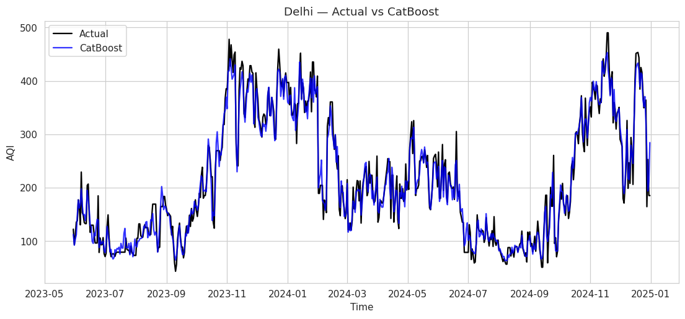
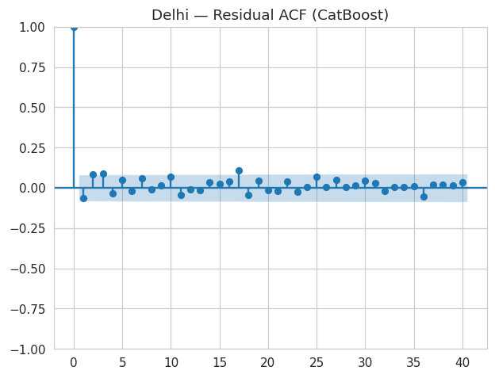
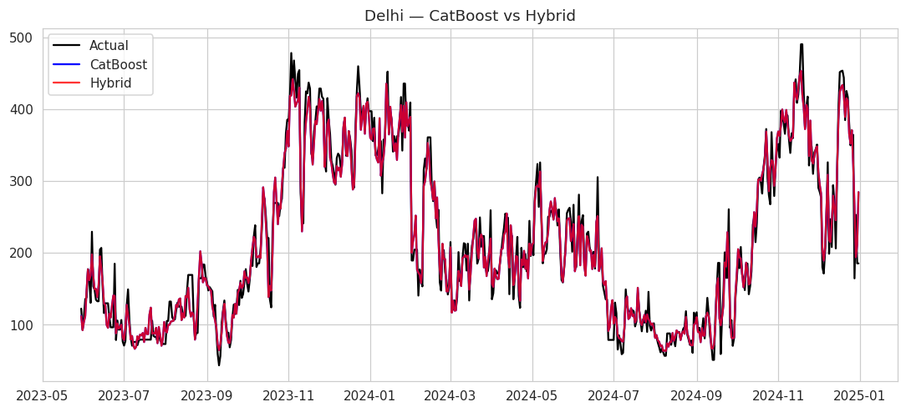

**Hybrid CatBoost–SARIMAX Framework for Daily AQI Forecasting in Indian Metropolitan Cities**

**Overview**
This project implements a hybrid machine learning and time-series framework for daily Air Quality Index (AQI) forecasting across major Indian metropolitan cities.

The model combines:

-CatBoost Regressor for nonlinear pollutant interaction modeling

-SARIMAX for capturing temporal autocorrelation in residuals

The goal is to build a transparent, reproducible, and research-oriented AQI forecasting pipeline using CPCB air quality data.

**Cities Covered**

- Delhi

- Mumbai

- Kolkata

- Chennai

- Jaipur

- Bengaluru

These cities were selected to represent diverse urban characteristics including traffic intensity, industrial activity, climatic diversity, and coastal versus inland conditions.

**Data Source**

Daily air quality and meteorological data were obtained from:

- Central Pollution Control Board (CPCB)

- State Pollution Control Boards (SPCBs)

**Data Processing Steps**

-Station-wise CSV files aggregated into city-level datasets

-Non-numeric entries removed

-Missing values handled using forward-fill and median imputation

-Continuous daily date range enforced

-Outliers capped using IQR method

-Time-series features engineered (lags, rolling means, calendar features)

**Modeling Framework**

**1. CatBoost Model**

-Learns nonlinear relationships between pollutants and AQI

-Handles complex feature interactions automatically

-Time-based 80–20 train-test split

-Early stopping applied to prevent overfitting

**2. Residual Analysis**

-Residuals from CatBoost analyzed using Autocorrelation Function (ACF)

-Significant autocorrelation checked before applying hybrid modeling

**3. Hybrid Model**

-SARIMAX trained on CatBoost residuals

-Weekly seasonality considered (m = 7)

**Final prediction:**

Hybrid Prediction = CatBoost Prediction + SARIMAX Residual Forecast

**Evaluation Metrics**

-RMSE (Root Mean Squared Error)

-R² Score

Performance comparison performed between:

-CatBoost

-Hybrid (CatBoost + SARIMAX)

Residual diagnostics and ACF plots included for transparency and validation.

## Repository Structure

AQI-Hybrid-CatBoost-SARIMAX/
│
├── city_data/              # City-wise processed CSV files
├── AQI_Hybrid_Model.ipynb  # Google Colab notebook
├── results/                # Output plots and comparison tables
└── README.md

**How to Run (Google Colab)**

-Upload city-wise CSV files to Google Drive

-Open the notebook in Google Colab

-Install dependencies:

!pip install catboost

-Mount Google Drive

-Update DATA_FOLDER path

-Run cells sequentially

## Results Summary

Performance comparison between CatBoost and Hybrid (CatBoost + SARIMAX):

- In most cities, CatBoost achieved strong R² scores (0.74 – 0.97).
- Hybrid modeling showed marginal improvements in some cities.
- In cities with low residual autocorrelation, hybrid gains were negligible.
- This suggests that nonlinear pollutant interactions dominate AQI prediction, while residual temporal structure is limited in some regions.

Overall observation:
CatBoost alone performs competitively, and hybrid modeling is beneficial only when residual autocorrelation is significant.

## Example Visualizations

### Delhi — Actual vs CatBoost Prediction

---

### Delhi — Residual Autocorrelation (ACF)

---

### Model Performance Comparison Across Cities

**Key Highlights**

-Time-series aware train-test splitting (no data leakage)

-Residual autocorrelation testing before hybrid modeling

-City-level independent modeling

-Reproducible Google Colab pipeline

-Transparent model comparison

**Research Focus**

This project explores hybrid modeling approaches that combine gradient boosting and statistical time-series models for environmental forecasting.

The emphasis is on reproducibility, methodological clarity, and honest performance evaluation.

**Author**

Tripti Singh
B.Tech Computer Science and Engineering
Hybrid Machine Learning Research in Air Quality Forecasting

## Ethical Note

This repository presents results exactly as obtained from the implemented pipeline.
No manual performance adjustments or metric manipulation were performed.
The focus is on methodological transparency and reproducibility.

